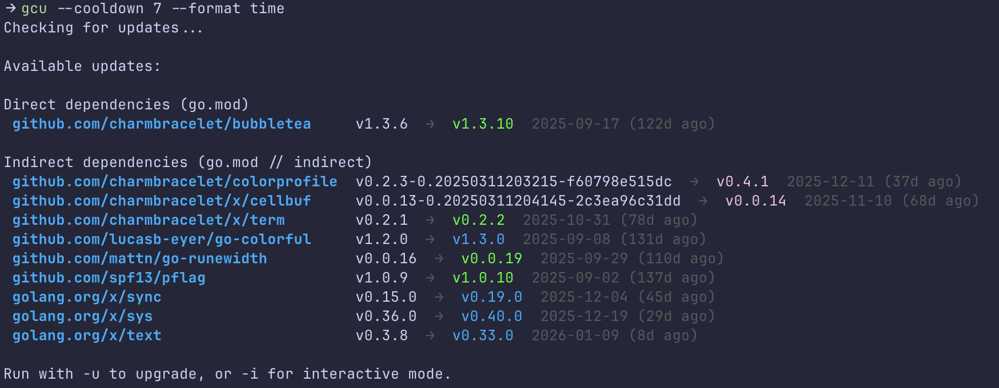

## go-check-updates (gcu)

`gcu` is a Go-first dependency management utility. Run it in a module root to see which dependencies can be upgraded, choose the ones you want, and let it rewrite `go.mod`/`go.sum` for you.



## Highlights

- Detect direct and optional transitive (`--all`) updates with a single command.
- Interactive Bubble Tea UI for selective upgrades (`-i`).
- Script-friendly `--format` options (`lines`, `group`, `time`).
- Cooldown window to skip freshly published versions (`--cooldown 14`).
- Works great in CI or locally; plain `gcu` is a dry run, `-u` applies changes.

## Install

```bash
go install github.com/pragmaticivan/go-check-updates/cmd/gcu@latest
```

From source:

```bash
git clone https://github.com/pragmaticivan/go-check-updates.git
cd go-check-updates
go build -o gcu ./cmd/gcu
```

## Quick start

| Task | Command | Notes |
| --- | --- | --- |
| Dry run (recommended) | `gcu` | Lists direct updates grouped by direct/indirect |
| Upgrade everything | `gcu -u` | Applies updates, then runs `go mod tidy` |
| Interactive picker | `gcu -i` | Use space to toggle, enter to confirm |
| Check vulnerabilities | `gcu -v` | Shows vulnerability counts for current and updated versions |
| Filter names | `gcu --filter charm` | Accepts substring or regex via Go's `regexp` |
| Include transitive deps | `gcu --all` | Adds modules pulled in indirectly |
| Skip fresh releases | `gcu --cooldown 30` | Ignores versions published in last N days |

### Output formats

```bash
# Pipe-friendly
gcu --format lines

# Group major/minor/patch and show publish date
gcu --format group,time
```

Combine formats with commas to mix behaviors.

## Typical workflow

1. Run `gcu` to review upcoming upgrades.
2. Re-run with `-i` or `-u` depending on how selective you need to be.
3. Commit the updated `go.mod`/`go.sum` and run `go test ./...` (the GitHub Actions workflow does the same check).

## How it works

1. `gcu` shells out to `go list -m -u -json` to discover available versions.
2. When upgrading, it executes `go get module@version` for each selection.
3. A final `go mod tidy` keeps the module graph consistent.

### Vulnerability scanning

When using the `-v` / `--vulnerabilities` flag, `gcu` queries the [OSV (Open Source Vulnerabilities) API](https://osv.dev) to check for known security issues in your dependencies.

For each module with available updates, it:
1. Checks the current version for vulnerabilities
2. Checks the update version for vulnerabilities
3. Shows a comparison with color-coded severity levels:
   - `L (n)` - Low severity
   - `M (n)` - Medium severity (yellow)
   - `H (n)` - High severity (orange)
   - `C (n)` - Critical severity (red)

Example output:
```
gopkg.in/yaml.v3   v3.0.0  →  v3.0.1 [H (1)] → ✓ (fixes 1)
```

This indicates the current version has 1 HIGH severity vulnerability that will be fixed by upgrading.

## Development

```bash
go test ./...
```

## License

Licensed under the Apache License 2.0. See [LICENSE](LICENSE).

## Inspiration

* `npm-check-updates`
